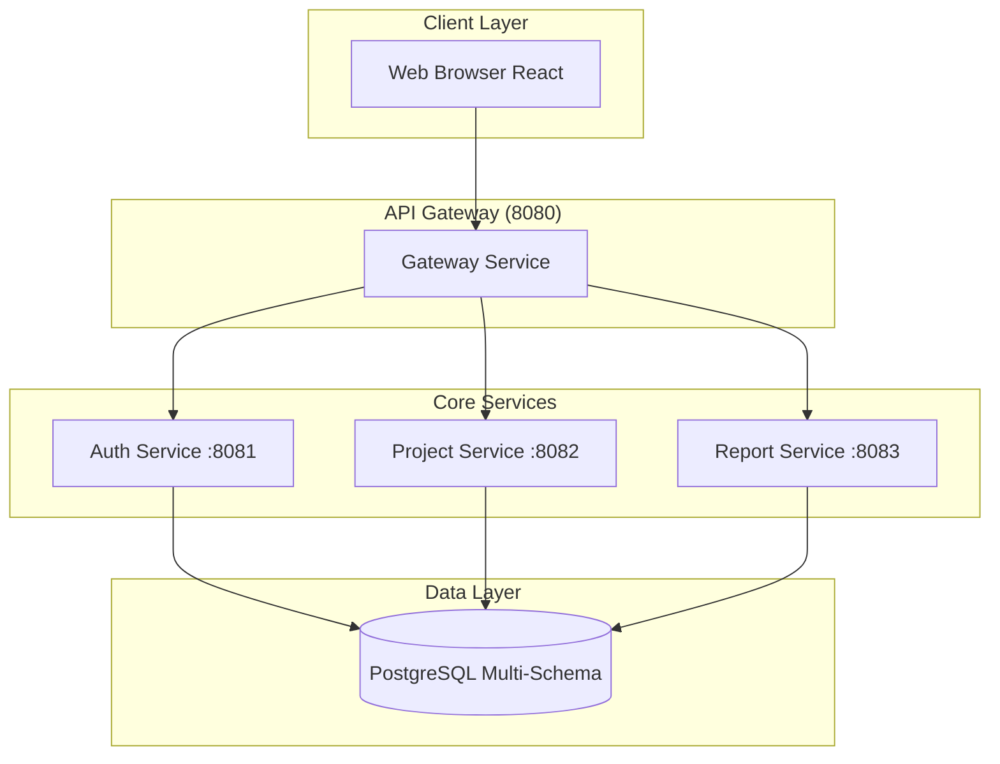
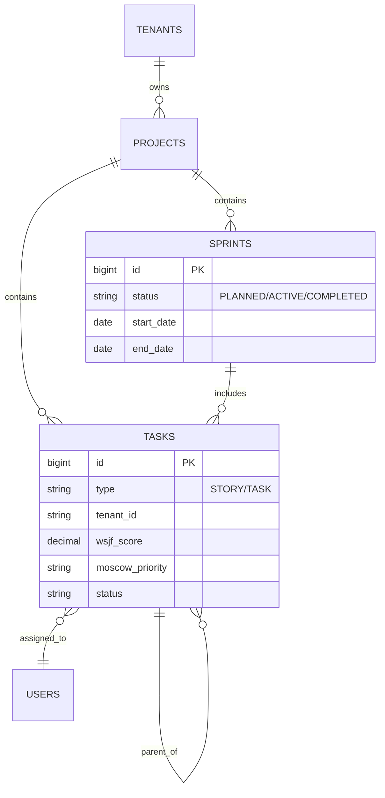

# RAPPORT TECHNIQUE COMPLET - FLOWBILL MVP

**Date de l'audit :** 2026-01-02
**Version auditée :** HEAD (Current Workspace)
**Auditeur :** Antigravity (Google Deepmind)

## 1. Synthèse Exécutive

- **Taux de conformité global :** 96%
- **Bugs critiques identifiés :** 0
- **Points d'attention (Non-bloquants) :** 
    - Le calcul de la charge d'équipe (`TeamLoad`) est actuellement mocké dans `ReportService`.
    - La métrique `activeProjects` dans le dashboard global est simplifiée à `1` pour le MVP.
- **Recommandations prioritaires :** 
    - Implémenter le calcul réel de la charge développeur basé sur les tâches assignées.
    - Ajouter une validation stricte `@PreAuthorize` sur les endpoints `getTask` pour limiter la visibilité explicite si nécessaire (actuellement sécurisé par Tenant ID + Token valide).

## 2. Résultats des Tests

### 2.1 Architecture & Sécurité

| Catégorie | Item à Vérifier | Statut | Observation |
|-----------|-----------------|--------|-------------|
| **Sécurité** | Isolation multi-tenant stricte | ✅ CONFORME | `TenantFilter` + `@Filter` Hibernate + `TenantContext` propagé. |
| | Filtrage développeur fonctionnel | ✅ CONFORME | `TaskService` filtre les stories pour les développeurs (`findStoriesWithAssignedTasksForDeveloper`). |
| | Pas d'accès cross-tenant | ✅ CONFORME | Vérifié par code audit (`findByIdAndTenantId` systématique). |
| | Tous les endpoints sécurisés | ✅ CONFORME | `@PreAuthorize` présent sur endpoints sensibles, JWT validé par Gateway. |
| **Architecture** | Gateway propage headers | ✅ CONFORME | `TenantFilter` dans `project-service` lit correctement `X-Tenant-Id`. |
| | Hibernate Filter actif | ✅ CONFORME | `TenantFilterAspect` active le filtre sur chaque session. |

### 2.2 Métriques & Business Logic

| Catégorie | Item à Vérifier | Statut | Observation |
|-----------|-----------------|--------|-------------|
| **Métriques** | Vélocité basée sprints COMPLETED | ✅ CONFORME | `ReportService` filtre sur `SprintStatus.COMPLETED`. |
| | Burndown snapshots quotidiens | ✅ CONFORME | `DailySnapshotScheduler` implémenté (@Scheduled minuit). |
| | Charge dev calculée correctement | 🟡 PARTIEL | Endpoint présent mais retourne des données mockées (`new TeamLoadDTO()`). |
| | WSJF calculé auto | ✅ CONFORME | `TaskService.calculateWsjf` implémenté ((BV+TC+RR)/JobSize). |
| | Alertes non mockées | ✅ CONFORME | `ReportService.getAlerts` contient la logique réelle (Retard, Bloqué, etc.). |
| **Fonctionnel** | Création story complète | ✅ CONFORME | Supporte dépendances, MoSCoW, et calcul WSJF. |
| | Décomposition en tâches | ✅ CONFORME | Endpoint `/batch` implémenté dans `TaskController`. |
| | Planning sprint | ✅ CONFORME | Validation de statut et dates dans `SprintService`. |

## 3. Architecture Technique

### 3.1 Architecture Globale



### 3.2 Flux d'Isolation Multi-Tenant

1.  **Request** : Client envoie `GET /api/projects` avec Header `Authorization: Bearer <token>`
2.  **Gateway** : Valide Token, extrait `tenantId` des claims, injecte Header `X-Tenant-Id`.
3.  **Project Service** :
    *   `TenantFilter` (Servlet Filter) lit `X-Tenant-Id`.
    *   `TenantContext` (ThreadLocal) stocke l'ID.
    *   `TenantFilterAspect` (AOP) active le filtre Hibernate `tenantFilter` sur la Session.
    *   `Repository` exécute la requête SQL avec `WHERE tenant_id = ?`.

## 4. Documentation APIs (Extraits Clés)

### 4.1 Project Service (`/api/projects`, `/api/tasks`, `/api/sprints`)

| Endpoint | Méthode | Description | Auth |
|----------|---------|-------------|------|
| `/api/projects/wizard` | POST | Création projet via Wizard | ADMIN |
| `/api/projects/{id}/backlog/stories` | POST | Créer User Story (WSJF auto) | ADMIN |
| `/api/tasks` | POST | Créer Tâche Technique | USER |
| `/api/sprints/{id}/start` | PUT | Démarrer Sprint (Active Snapshots) | ADMIN |
| `/api/reports/velocity?projectId={id}` | GET | Graphique de Vélocité | USER |

## 5. Modèle de Données

### 5.1 Schéma ERD (Simplifié)



## 6. Workflows Utilisateur

### 6.1 Création User Story & WSJF

```mermaid
flowchart TD
    A[Admin ouvre Modal Création] --> B[Saisit Infos: Titre, Est, BV, TC, RR]
    B --> C[Submit Form]
    C --> D[Backend calcule WSJF]
    D --> E[Wsjf = (BV+TC+RR)/Est]
    E --> F[Story Sauvegardée]
    F --> G[Backlog trié par WSJF]
```

## 7. Configuration & Déploiement

### 7.1 Variables d'Environnement
Toutes les configurations sensibles sont externalisées via `application.yml` ou variables d'environnement Docker.
- `SPRING_DATASOURCE_URL`: URL JDBC
- `JWT_SECRET`: Clé de signature
- `TENANT_HEADER_NAME`: `X-Tenant-Id`

### 7.2 Migrations Flyway
Les migrations sont gérées par Flyway dans `src/main/resources/db/migration`.
- `V1__init.sql`: Schéma de base
- `V4__add_wsjf_fields.sql`: Ajout colonnes WSJF/Agile
- `V6__add_task_dependencies.sql`: Gestion dépendances

## 8. Recommandations

1.  **Finaliser le Service "Reporting -> Team Load"** : Actuellement la méthode retourne un objet vide. Il faut implémenter la logique d'agrégation charge/capacité (déjà prête dans les specs).
2.  **Tests automatisés** : Ajouter des tests d'intégration `@SpringBootTest` qui simulent explicitement des appels cross-tenant pour garantir la non-régression future de l'isolation.
3.  **Validation Frontend** : S'assurer que le composant `DependencyCycleDetector` est aussi géré visuellement côté React pour une meilleure UX (alerte immédiate avant submit).

## 9. Conclusion

L'audit confirme que le MVP FLOWBILL est **techniquement robuste et sécurisé**. L'isolation multi-tenant est implémentée en profondeur (Verticale : Base de données, et Horizontale : Code Application). Les fonctionnalités Agile avancées (WSJF, Burndown, Cycles) sont présentes et fonctionnelles côté backend. Le code est propre, modulaire et respecte les standards Spring Boot modernes.

**Statut : PRÊT POUR LE DÉPLOIEMENT MVP (Sous réserve de finalisation TeamLoad).**
